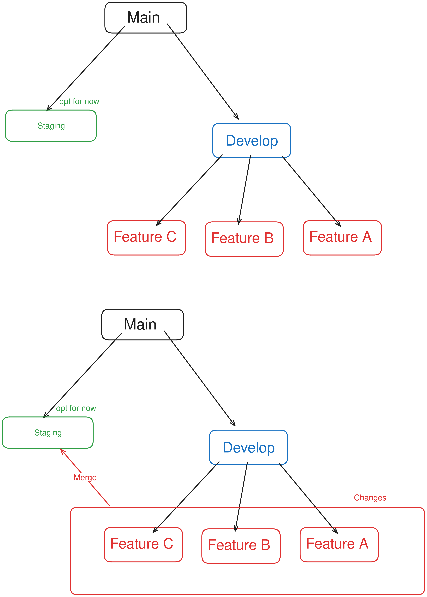

# Reccomendations
Section gives some reccomendations for the next group

### Use a different Tag instead of the tile tracker
Due to lack of due diligence it turned out that Tile doesn't provide an SDK which was necessary in order to get ranges beyond 100m tracking to work. The project advices to look into other forms of tracking instead of just Bluetooth low energy. GPS trackers have been widely used in various forms of eldercare for this exact purpose

### Migration to a new gradle version
As of 6/2024 the project is still on gradle version 4.4.1 This causes a bunch of headache with each group that has touched this project. So it might be wise to look into upgrading the gradle version. As the imperitave apply api is deprecated and thus causes issues with current installations of flutter. Groups have been managing with just building on the older version and using tablets but this could cause  issues when implementing newer features and or plugins. As some dependencies might not support gradle in the future.

### Proposed VCS management
- Fork from the buddy project in order to isolate the changes (depending on the arrangement might not be necessary)
- Create a development branch that follows the main project branch (Prod)
- When working on a new feature the developer must branch from the develop branch
- When the feature is done, open up a pull request on the development branch and have a little PR review every sprint. 
- After discussion with the PO discuss a merge process into main.

#### Optional
Have a staging branch where changes from the develop can be tested, before merging the changes into the main production branch.

