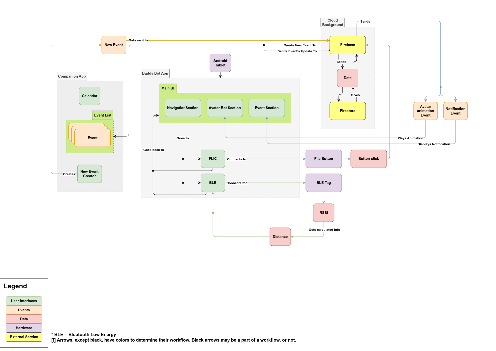

# Social Buddy

The social buddy project consists of three integral parts

- The Buddy App, which has the "Tamagotchi" style mascot and interacts with the elderly user.
- The Buddy Companion App consists of several features to assist the user (caretaker) in providing aid to their clients
- The backend of Social buddy is a firebase instance in which it utilizes the firestore NoSQL database to send and receive messages between these two apps.

The project follows a [MVC](https://en.wikipedia.org/wiki/Model%E2%80%93view%E2%80%93controller) architecture  (Model- View - Controller) 

---
## Project 7/8 2024 (Features)
- [Bluetooth Low energy distance detection](./features/bluetooth_low_energy.md)
- [Flic Button](./features/flic.md)

